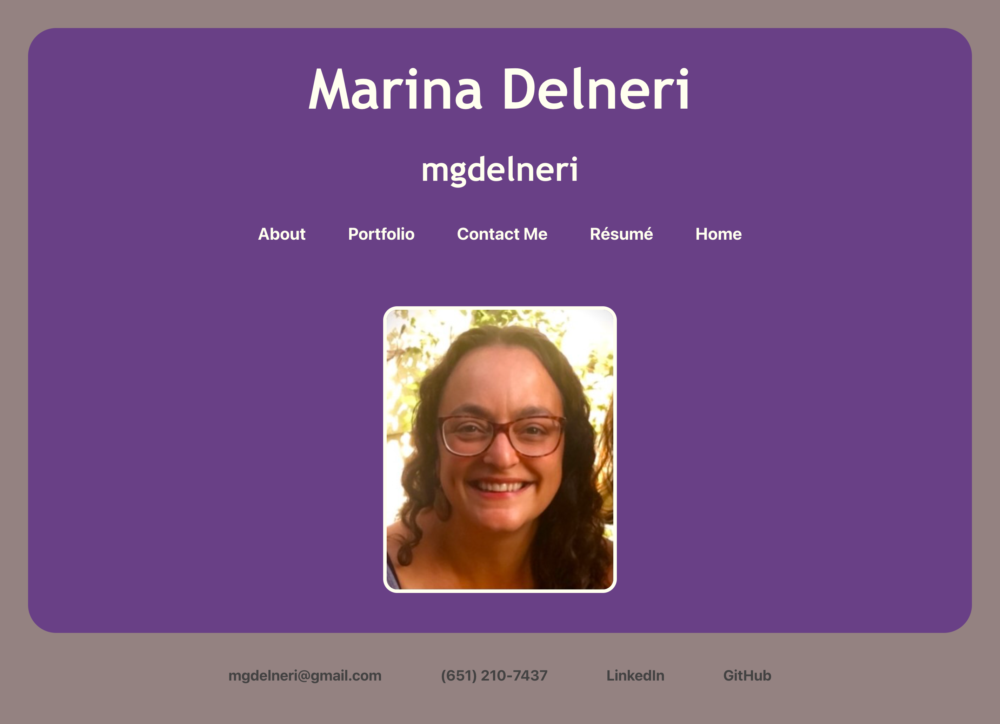
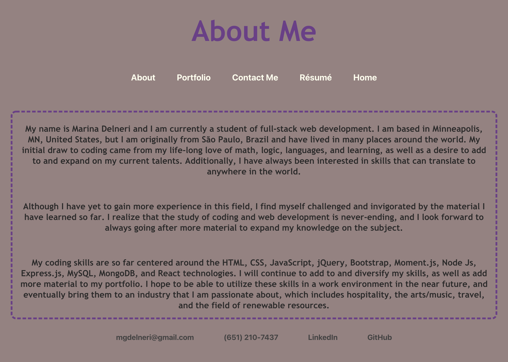
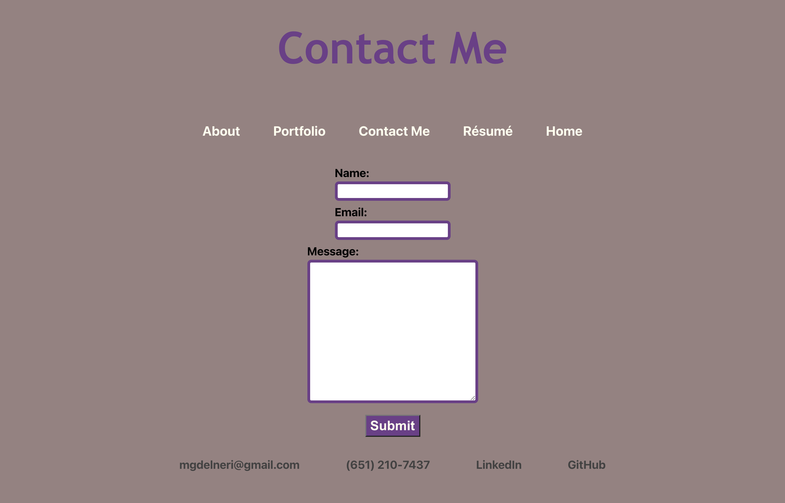
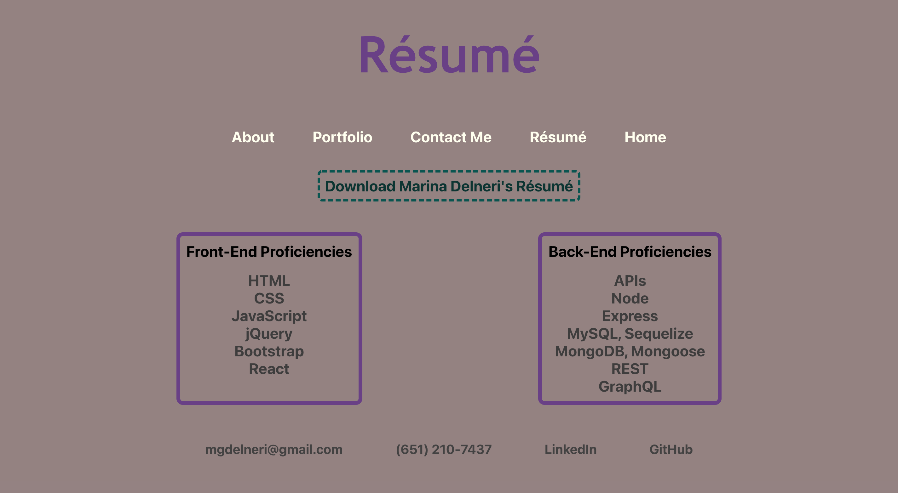

# React Portfolio

## GOAL

The goal of this asignment was to create my own developer portfolio using React. 

This portfolio app had to have four sections: About Me, Portfolio, Contact Me, and Résumé. 

The About Me section includes a short bio about me and my web development skills. 

The Portfolio section displays some of my deployed work, with links to both the deployed pages and the GitHub pages associated with each project. 

The Contact Me page has a form where the user can enter their name, email address, and a message. It also has a link to my phone number, email address, LinkedIn profile, and GitHub profile. (Note: these links make up the Footer of every page in the portfolio)

The Résumé page has a list of the technologies that I have experience with, as well as a link to a downloadable version of my résumé.

## PROCESS

After studying the requirements for this assignment, I created a React app in VS Code and started a repository for my app in GitHub. 

Before doing any hard coding, I looked over the React activities from class and watched aditional tutorials. I then was better equipped to create a folder and file system that would be better suited for my purposes in the already-created React app. Besides adding folders and files, I got rid of unnecessary files that came with the app. 

I then looked back at my original portfolio app, assigned to us weeks ago, that only used HTML and CSS. I decided I would model my React portfolio on that code. 

The first few things I coded were the App.js, App.css, and index.html files, so I could better test my code as I went along. 

I then started working on my Components, with snippets from my original portfolio's HTML code. For each Component I completed, I styled it in its related CSS file. 

After the initial code was set in place, it was a matter of playing around with the page's functionality and style. I looked back at the instructions for the assignment and made sure that everything was set in place. 

I tested the app several times, tweaking things along the way. 

Here are some images of my React Portfolio: 

Home page:

About Me page: 

Portfolio page: 

Contact Me page: 

Résumé page: 

## USAGE

Here is a link to the deployed app: [React Portfolio](https://secret-mountain-24931.herokuapp.com/)

The user can also access the app in VS Code after the React-Portfolio repository has been cloned from GitHub. After installing node modules and all of the necessary dependencies, simply start the router using "npm run start". It should automatically open the browser. 

## CONCLUSION

I very much enjoyed this assignment. It turns out I really like React. The last few assignments have been incredibly challenging and frustrating. This one was also challenging, but I found that I understood it much better and felt invigorated by it. 

It was helpful to have an already-existing, even if much simpler, portfolio as a reference. It allowed me to not get boggled down by the HTML/JSX elements as much, and really dig deep into the functionality of React. 

I think this portfolio, as with all apps, has much room for improvement, both functionally and stylistically, and I look forward to continuing to work on it, as well as add more projects to the Portfolio page. 

It feels great to be able to start combining all of the major themes we have learned so far in such a succinct and fun way. 

